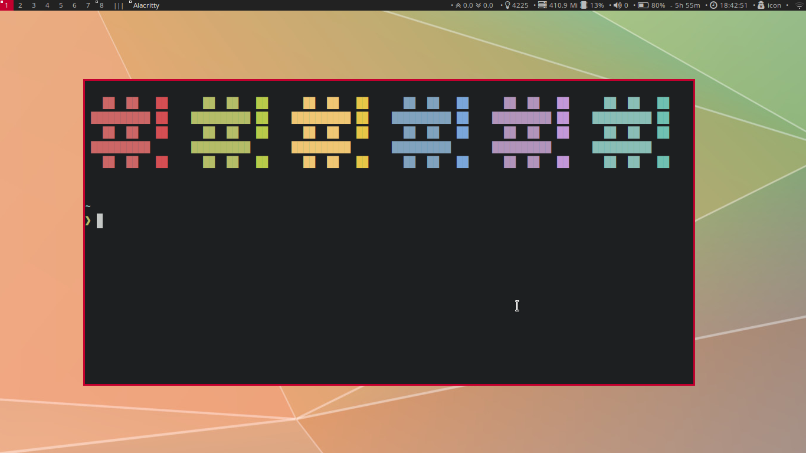

# DWM - Icon's Build

<div style="background-color: #222; color: red; border: 1px solid; padding: 10px; margin-bottom: 10px; display: flex; justify-content: center; align-items: center;padding-bottom:4px;font-weight: bold; flex-direction: column;">

Patched by :  [Nabeel Ali - https://iconiccodes.com](https://iconiccodes.com)


</div>

## Why I needed that?
This is my buid DWM - Dynamic Tiling Window Manager. In my opinion it is one of the best tiling window managers. The only downside, is it's modification. The patching system is very weird and users require to edit code manually and place failed patches.

## Screenshots

### Home


### Default Layout - Tiling - MODKEY + T


### Grid Layout - MODKEY + G


### Columns Layout - MODKEY + C
* MODKEY + i to increase clients in master stack
* MODKEY + d to increase clients in master stack
>


### Floating - MODKEY + F | MODKEY + Shift + Space for single window in Tiling mode

* MODKEY + Left Click  and Drag to move
* MODKEY + Right Click Drag to resize




## Patches Applied
* dwm-attachbottom-6.2.diff 
* dwm-autostart-20210120-cb3f58a.diffXX
* dwm-columns-6.2.diff 
* dwm-cfacts-vanitygaps-6.2_combo.diff
* dwm-pertag-20200914-61bb8b2.diff
* dwm-systray-6.3.diff 
* dwm-gridmode-20170909-ceac8c9.diff
* dwm-movestack-20211115-a786211.diff
* dwm-colorbar-6.2.diff 
* dwm-focusmaster-20210804-138b405.diff
* dwm-alwayscenter-20200625-f04cac6.diff

## Packages [Ubuntu]
* Thunar
* Pavucontrol
* Xfce4-screenShooter
* Firefox
* Dunst
* Nitogren
* Pasystray

## Layouts
This build has following layouts
* Tiling
* Floating
* Monocle
* Grid
* Column

## Autostart
This build has autostart patch applied. This is helpful in running script for startup. The file required is

```
~/.dwm/autostart.sh
```

Example:
```
#!/bin/bash
nitrogen --restore &
nm-applet &
enable_touch.sh &
```

## Keys
MODKEY = Super Key | Win Key


| Key  | Function  |
|---|---|
| MODKEY + Shift + Enter  | Open Terminal [Alacritty]   |
| MODKEY + [1..8]  | Switch Tag   |
| MODKEY + Shift + [1..8]  | Move Window to Tag   |
| MODKEY + Shift + c  | Kill Window   |
| MODKEY  + t  | Tiling Layout   |
| MODKEY  + f  | Floating Layout   |
| MODKEY  + c  | Column Layout   |
| MODKEY  + g  | Grid Layout   |
| MODKEY  + m  | Mocole Layout   |
| MODKEY  + l  | Incrase Master Width  |
| MODKEY  + h  | Decrease Master Width|
| MODKEY  + j  | Focus Previous Tile|
| MODKEY  + k  | Foucs Next tile|
| MODKEY  + Shift + x  | Xkill |
| MODKEY  + Shift + j  | Move Position Next tile|
| MODKEY  + Shift + k  | Move Position Previous Tile|
| MODKEY  + Enter  | Make the select stack tile Master|
| MODKEY  +  Shift +  h  | Increase Stack Tile Height|
| MODKEY  +  Shift +  l |  Decrase Stack Tile Height|
| MODKEY  + i  | [^1] Increment Clients in Master   |
| MODKEY  + d  | [^2] Decrement Clients in Master   |
| MODKEY  + d  | Decrement Layout   |
| MODKEY  + d  | Decrement Layout   |
| MODKEY  + d  | Decrement Layout   |
| MODKEY  + d  | Decrement Layout   |
| MODKEY  + d  | Decrement Layout   |
| MODKEY + Control  + 0  | Enable Disable Gaps   |


[^1]. Number of columns in Column Layout. Last is stacked like tile.
